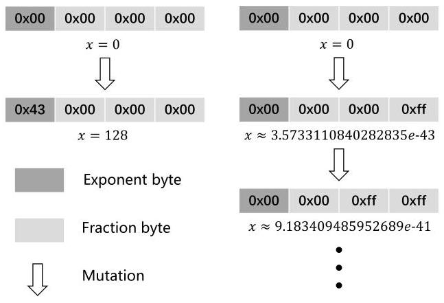
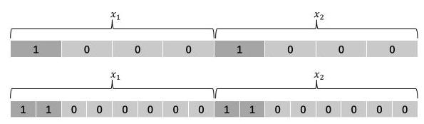
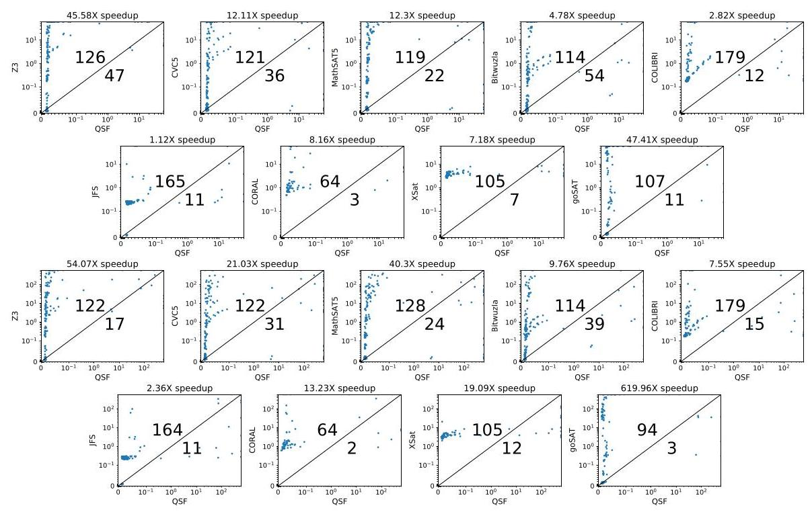
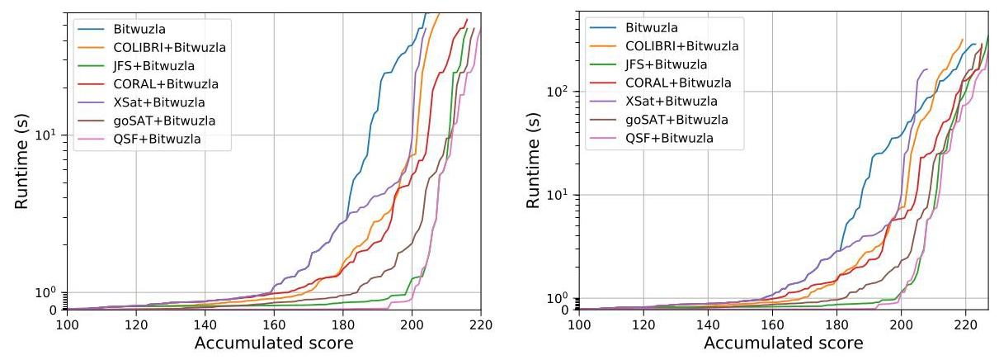
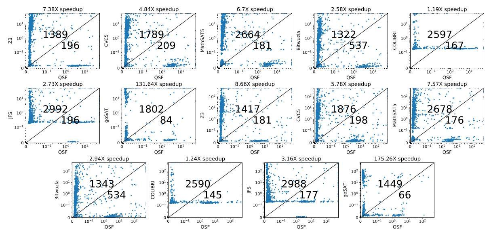
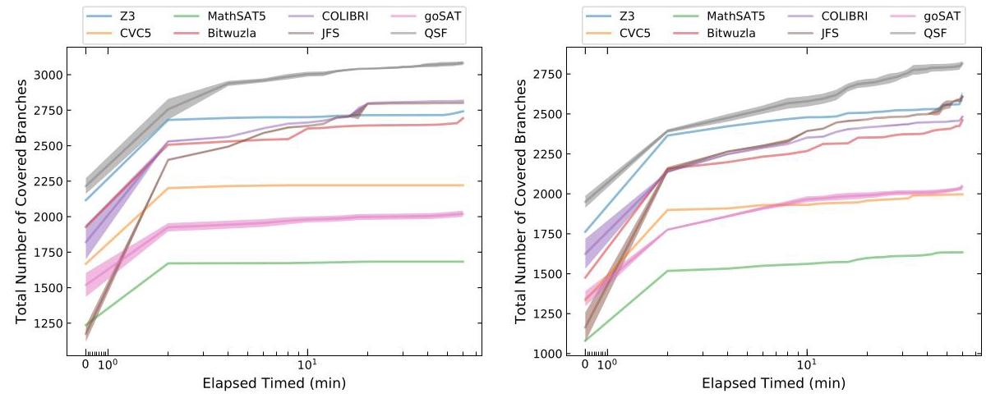

# QSF: Multi-objective Optimization Based Efficient Solving for Floating-Point Constraints*

XU YANG, National University of Defense Technology, China ZHENBANG CHEN \( {}^{ \dagger  } \) , National University of Defense Technology, China WEI DONG, National University of Defense Technology, China JI WANG \( {}^{ \dagger  } \) , National University of Defense Technology, China

Floating-point constraint solving is challenging due to the complex representation and non-linear computations. Search-based constraint solving provides an effective method for solving floating-point constraints. In this paper, we propose QSF to improve the efficiency of search-based solving for floating-point constraints. The key idea of QSF is to model the floating-point constraint solving problem as a multi-objective optimization problem. Specifically, QSF considers both the number of unsatisfied constraints and the sum of the violation degrees of unsatisfied constraints as the objectives for search-based optimization. Besides, we propose a new evolutionary algorithm in which the mutation operators are specially designed for floating-point numbers, aiming to solve the multi-objective problem more efficiently. We have implemented QSF and conducted extensive experiments on both the SMT-COMP benchmark and the benchmark from real-world floating-point programs. The results demonstrate that compared to SOTA floating-point solvers, QSF achieved an average speedup of \( {15.72}\mathrm{X} \) under a 60-second timeout and an impressive \( {87.48}\mathrm{X} \) under a 600-second timeout on the first benchmark. Similarly, on the second benchmark, QSF delivered an average speedup of 22.44X and 29.23X, respectively, under the two timeout configurations. Furthermore, QSF has also enhanced the performance of symbolic execution for floating-point programs.

## CCS Concepts: \( \cdot \) Software and its engineering \( \rightarrow \) Software testing and debugging; Search-based software engineering.

Additional Key Words and Phrases: Floating-Point, Constraint Solving, Multi-Objective Optimization, Search-Based, Symbolic Execution

## ACM Reference Format:

Xu Yang, Zhenbang Chen, Wei Dong, and Ji Wang. 2025. QSF: Multi-objective Optimization Based Efficient Solving for Floating-Point Constraints. Proc. ACM Softw. Eng. 2, FSE, Article FSE024 (July 2025), 21 pages. https://doi.org/10.1145/3715739

*This work is supported by National Key R&D Program of China (No. 2022YFB4501903) and the NSFC Programs (No. 62172429, 62032024 and U2341212).

\( {}^{ \dagger  } \) Zhenbang Chen and Ji Wang are the corresponding authors.

Authors' Contact Information: Xu Yang, State Key Laboratory of Complex & Critical Software Environment, College of Computer Science and Technology, National University of Defense Technology, Changsha, Hunan, China, xuyang369@ nudt.edu.cn; Zhenbang Chen, State Key Laboratory of Complex & Critical Software Environment, College of Computer Science and Technology, National University of Defense Technology, Changsha, Hunan, China, zbchen@nudt.edu.cn; Wei Dong, State Key Laboratory of Complex & Critical Software Environment, College of Computer Science and Technology, National University of Defense Technology, Changsha, Hunan, China, wdong@nudt.edu.cn; Ji Wang, State Key Laboratory of Complex & Critical Software Environment, College of Computer Science and Technology, National University of Defense Technology, Changsha, Hunan, China, wj@nudt.edu.cn.

## 1 INTRODUCTION

Constraint solving [9] is fundamental for addressing problems expressed in various logics. Satisfiability Modulo Theories (SMT) [38] is an important method for constraint solving, offering decision procedures to check the satisfiability of first-order logic formulas under different logical theories. SMT has been widely used as a general problem-solving engine in numerous software engineering domains, including software testing [48, 57], program verification [3, 25], program synthesis [8, 51], etc. With the increasing scope of applications, SMT has evolved significantly, providing more expressive logic for problem encoding and more efficient algorithms for problem-solving. Many new SMT theories have been introduced, such as bit-vector [7], array [11], and point logic [62] theories. Many excellent SMT solvers, such as Z3 [21], MathSAT5 [17], and CVC5 [4], have been developed and are widely used in various software tools.

Due to the widespread use of floating-point programs, solving floating-point constraints is crucial. Existing floating-point constraint solving methods can be divided into three categories: 1) Representing float-point numbers as real numbers and using real arithmetic SMT solving [30, 44]. 2) Precise representation of floating-point numbers based on bit-vector theory, i.e., QF_FP SMT theory, whose solving procedure converts a floating-point constrain to a SAT [13] problem (i.e., an NP-complete problem [18]) and employs an existing SAT solver for solving [17, 21]. 3) Search-based methods transform the constraint solving problem into a search or optimization problem [27, 56].

The first category could be efficient but faces the imprecision problem and the expressiveness problem. The results produced by real arithmetic SMT solvers are unsound for floating-point constraints. The real arithmetic SMT theory does not support certain floating-point operations, such as bitwise logical and shift operations. The second category enjoys the precise representation but suffers from the scalability problem. The SAT problems of floating-point constraints may be huge, especially for the non-linear constraints, making the solving procedure inefficient. Improving the scalability of floating-point SMT theory is challenging. The third category may achieve good scalability and efficiency through existing optimization or search techniques but encounters the problem of incompleteness. Search-based methods are effective in improving efficiency when the solution space is large. Nonetheless, the scalability issue remains challenging for the third category when dealing with floating-point constraint solving problems with extremely small solution spaces.

This paper focuses on search-based methods for floating-point constraint solving, which use scoring functions, guiding indicators, and fitness functions to find solutions for floating-point constraints heuristically. We observe that existing approaches [42][36] typically rely on a single objective to guide the search process. This can lead to inefficiencies in many scenarios, such as prematurely discarding valuable intermediate solutions. Therefore, it is desirable to have multiple objectives to evaluate the potential of intermediate solutions, thereby improving the efficiency of the solving process.

Based on this observation, we propose \( {\mathrm{{QSF}}}^{1} \) , a method for quickly solving floating-point constraints. Inside QSF, we propose a bi-objective optimization-based method in which two indicators, i.e., the number of unsatisfied constraints and the sum of the violation of unsatisfied constraints, are used to evaluate the quality of intermediate solutions. Besides, we also propose a customized evolutionary algorithm in which the evolutionary operators are specially designed for floating-point type to improve the search efficiency. We have implemented QSF in a prototype and conducted extensive experiments on a standard benchmark and a benchmark generated from the program analysis of real-world floating-point programs. Besides, we embedded QSF to a state-of-the-art symbolic execution tool (i.e., KLEE) for C programs to evaluate its ability to improve symbolic execution's effectiveness. The experimental results indicate the QSF's efficiency.

---

\( {}^{1} \) QSF is the abbreviation of a Quick Solver for Floating-point constraints.

---

The main contributions of this paper are as follows:

- We propose a search-based constraint solving framework based on multi-objective optimization. As far as we know, QSF is the first approach to employ multi-objective optimization for floating-point constraint solving.

- We propose two objectives for solving the problem of floating-point constraints. The first objective is the number of unsatisfied constraints, and the second objective function is the violation degree of unsatisfied constraints.

- We present a multi-operator collaborative evolutionary algorithm (MOCEA) with mutation operators specifically designed for floating-point types to enhance efficiency.

- We evaluate QSF by comparing its prototype with nine state-of-the-art floating-point constraint solvers. Experimental results on the standard benchmark of SMT-COMP 2023 show that QSF outperforms other solvers, with average speedups of \( {15.72}\mathrm{X} \) and \( {87.48}\mathrm{X} \) at the \( {60}\mathrm{\;s} \) and 600s, respectively. The benchmark results extracted from real-world floating-point programs (i.e., GNU Scientific Library [29]) demonstrate that QSF can solve the most instances and has achieved an average speedup of \( {22.44}\mathrm{X} \) within 60 seconds and \( {29.23}\mathrm{X} \) within 600 seconds compared to other solvers.

The remainder of this paper is organized as follows. Section 2 introduces the preliminaries and motivation. Section 3 describes QSF. Section 4 presents the experiments and analysis. Section 5 discusses threats to validity. Section 6 reviews related work. Section 7 concludes the paper.

## 2 PRELIMINARIES AND MOTIVATION

### 2.1 Floating-point Numbers

Real numbers in the real world are represented in computers as floating-point numbers. The IEEE standard 754 [34] is the de-facto standard for floating-point numbers [1]. This standard defines a floating-point number, denoted as \( {fp} \) , in terms of three components: \( \operatorname{sign}\left( S\right) \) , exponent(E), and mantissa(M). The following formula describes the calculation of the number.

\[
{\left( -1\right) }^{S} \times  M \times  {2}^{E}\text{.} \tag{1}
\]

The sign bit(S)is the first bit of a floating-point number(fp), indicating its sign. \( S \) can be either 0 or 1, representing a positive or negative number, respectively. The mantissa(M)is represented as \( {m}_{0}.{m}_{1}{m}_{2}\ldots {m}_{n} \) , where \( {m}_{0} \) is the hidden bit and \( {m}_{1}{m}_{2}\ldots {m}_{n} \) is the fraction. The exponent(E)is \( {E}^{\prime } - {2}^{p - 1} + 1 \) , where \( p \) denotes the number of exponent bits and \( {E}^{\prime } \) is the biased exponent. A singleprecision floating-point number has an 8-bit exponent and a 23-bit fraction. A double-precision floating-point number has an 11-bit exponent and a 52-bit fraction. For example, if a single-precision floating-point number’s binary representation is001111110110000000000000000000000000, then \( S = 0 \) and \( p = 8 \) . Through calculation, \( {E}^{\prime } = {2}^{6} + {2}^{5} + {2}^{4} + {2}^{3} + {2}^{2} + {2}^{1} = {126}, M = 1 + {2}^{-1} + {2}^{-2} = {1.75} \) , and \( E = {126} - {127} =  - 1 \) . Therefore, this floating-point number represents \( {1.75} \times  {2}^{-1} = {0.875} \) .

We use \( \pm  f{p}_{\max } \) and \( \pm  f{p}_{\min } \) to represent the largest (smallest) and smallest (largest) positive (negative) normalized floating-point numbers, respectively. That is, \( \pm  f{p}_{\max } =  \pm  {1.11}\ldots {11} \times  {2}^{{E}_{\max }} \) and \( \pm  f{p}_{min} =  \pm  {1.0} \times  {2}^{{E}_{min}} \) . For single-precision floating-point numbers, \( {E}_{max} = {254} - {127} = {127} \) and \( {E}_{\min } = 1 - {127} =  - {126} \) . Hence, \( \pm  f{p}_{\max } =  \pm  {1.11}\ldots {11} \times  {2}^{127} \) and \( \pm  f{p}_{\min } =  \pm  {1.0} \times  {2}^{-{126}} \) .

### 2.2 Floating-point Constraints

Let \( \mathbb{F} \) be the set of floating-point numbers. A floating-point constraint \( \varphi \) is defined as follows, where \( \bowtie   \in  \{  < , \leq  , > , \geq  , = , \neq  \} , \odot   \in  \{  + , - , \times  ,/\} , c \in  \mathbb{F} \) is a floating-point constant, \( x \) is a floating-point variable, \( f \) is a floating-point function with \( n \) parameters, and \( f \) can be a library function, e.g., trigonometric and logarithmic functions, or a user-defined function.

\[
e \mathrel{\text{:=}} c\left| x\right| {e}_{1} \odot  {e}_{2} \mid  f\left( {{e}_{1},\ldots {e}_{n}}\right) . \tag{2}
\]

\[
\varphi  \mathrel{\text{:=}} \neg \varphi \left| {{\varphi }_{1} \land  {\varphi }_{2}}\right| {\varphi }_{1} \vee  {\varphi }_{2} \mid  {e}_{1} \bowtie  {e}_{2}. \tag{3}
\]

We use \( \mathbb{C} \) to represent the set of floating-point constraints.

In principle, we can use De Morgan’s laws [19] to eliminate the negation operator in \( \varphi \) and transform \( \varphi \) into Conjunctive Normal Form (CNF) [12], resulting in the following constraint \( \psi \) . Here, \( I \) is the number of clauses, \( {J}_{i} \) is the number of literals in the \( i \) -th clause, and \( {e}_{i, j}{ \bowtie  }_{i, j}{e}_{i, j}^{\prime } \) represents the \( j \) -th literal in the \( i \) -th clause.

\[
\psi  \mathrel{\text{:=}} \mathop{\bigwedge }\limits_{{i \in  I}}\mathop{\bigvee }\limits_{{j \in  {J}_{i}}}{e}_{i, j}{ \bowtie  }_{i, j}^{\prime }{e}_{i, j}^{\prime }. \tag{4}
\]

We regard the literal as an atomic constraint and the clause as a constraint.

### 2.3 Multi-Objective Optimization

Multi-objective optimization provides a paradigm for solving optimization problems and finds widespread applications across various fields, such as software engineering [16, 68] and artificial intelligence \( \left\lbrack  {{43},{63}}\right\rbrack \) . In practical engineering scenarios, numerous problems can be effectively represented and tackled by formulating them as multi-objective optimization problems (MOPs), which are subsequently addressed via specialized multi-objective optimization algorithms. MOPs involve the simultaneous optimization of multiple objective functions and can be formally defined as follows [64], where \( X \) is the decision variable, \( F\left( X\right) \) is an objective function vector consisting of \( m \) conflicting objective functions, and \( \Omega \) represents the decision space.

\[
\left\{  \begin{array}{l} \min F\left( X\right)  \mathrel{\text{:=}} \left( {{f}_{1}\left( X\right) ,{f}_{2}\left( X\right) ,\ldots ,{f}_{m}\left( X\right) }\right) , \\  \text{ subject to }X \in  \Omega . \end{array}\right.  \tag{5}
\]

We expect to find a set of trade-off solutions, called Pareto optimal solutions [15], for MOPs. Let \( {X}_{1},{X}_{2} \in  \Omega .{X}_{1} \) is said to dominate \( {X}_{2} \) (denoted by \( {X}_{1} \prec  {X}_{2} \) ) iff \( {f}_{i}\left( {X}_{1}\right)  \leq  {f}_{i}\left( {X}_{2}\right) \) for each \( i \in  \{ 1,\ldots , m\} \) and \( {f}_{j}\left( {X}_{1}\right)  < {f}_{j}\left( {X}_{2}\right) \) for at least one \( j \in  \{ 1,\ldots , m\} \) . If any \( X \) in \( \Omega \) cannot dominate \( {X}_{1} \) , we call \( {X}_{1} \) a non-dominated or Pareto optimal solution.

Evolutionary algorithm (EA) [24] is a global optimization algorithm with high robustness and wide applications, e.g., genetic algorithm [31], particle swarm optimization [35], and simulated annealing [60]. Since EA can explore multiple solutions simultaneously, it supports multi-directional search. Therefore, evolutionary algorithms are frequently used to solve multi-objective optimization problems, including NSGA-II [22], MOEA/D [66], SPEA2 [70], etc.

### 2.4 Motivation Example

We use a motivation example to demonstrate QSF's insight and its difference from the existing methods. Consider a floating-point constraint formula \( x \geq  {64} \land  y = {64} \) (denoted by \( \psi \) ) and the following two assignments that do not satisfy the constraint formula, where \( {f}_{1} \) represents the number of unsatisfied constraints under the assignment, and \( {f}_{2} \) represents the distance at which the current assignment becomes a satisfiable assignment, e.g., \( {f}_{2} = \left| {x - {64}}\right|  + \left| {y - {64}}\right| \) .

\[
\left\lbrack  {x \mapsto  0, y \mapsto  {64}}\right\rbrack  \;\left( {{f}_{1} = 1,{f}_{2} = {64}}\right)
\]

\[
\left\lbrack  {x \mapsto  {63}, y \mapsto  {63}}\right\rbrack  \;\left( {{f}_{1} = 2,{f}_{2} = 2}\right)
\]

If we use fuzzing-based solving [42] for \( \psi \) , the constraint solving problem is converted to a fuzzing problem, and coverage is used to guide the searching procedure, in which coverage reflects the number of satisfied constraints. Since the coverage is \( 0\left( {\text{i.e.,}2 - {f}_{1}}\right) \) under the second assignment, the assignment \( \left\lbrack  {x \mapsto  {63}, y \mapsto  {63}}\right\rbrack \) will be disregarded. On the other hand, if we use a single objective optimization-based solving method [36], which prioritizes the assignment with smaller \( {f}_{2} \) , the first assignment will be given a lower priority. However, as we can see, both assignments are promising for solving \( \psi \) and should be kept for future exploration.

Therefore, we propose QSF, a floating-point constraint solving method that simultaneously considers the number of unsatisfied constraints and the violation degree of unsatisfied constraints. Hence, QSF keeps both assignments for solving the example constraint \( \psi \) . Besides, finding solutions with respect to multiple evaluation metrics is a multi-objective optimization problem, and we also improve the optimization algorithm, especially for floating-point numbers. QSF includes mutation rules specifically designed for floating-point numbers. Assume that \( x \) and \( y \) in \( \psi \) are 32-bit floating-point numbers, and we want to find a better solution based on the first assignment. Since 64 is a satisfied assignment for \( y = {64} \) , Figure 1 shows only the mutation process of \( x \) . The left side illustrates the mutation of the exponent byte, while the right side shows the mutation of the fraction bytes. It is important to note that the exponent (fraction) bytes do not correspond exactly to the exponent (fraction) bits in the floating-point representation but rather to the closest approximate bytes. As shown in the figure, mutating the exponent part can generate an assignment of \( x \) that satisfies \( x \geq  {64} \) in one step, whereas mutating the fraction part requires more steps. Therefore, designing mutation operators specific to floating-point numbers can improve search efficiency.

Fig. 1. The mutation of Exponent (Fraction) byte.

## 3 APPROACH

QSF consists of two main components: transformer and optimizer. The transformer transforms a floating-point constraint formula into a multi-objective optimization problem, and the optimizer solves it using the proposed MOCEA.

### 3.1 Problem Transformation

Given a floating-point constraint \( \psi \) , this constraint solving problem can be transformed into a multi-objective optimization problem defined by the formula 6 , which contains two objective functions (i.e., \( {f}_{1}^{\psi } \) and \( {f}_{2}^{\psi } \) ), making it a bi-objective optimization problem. \( {f}_{1}^{\psi } \) and \( {f}_{2}^{\psi } \) are multiplied by \( \frac{1}{n} \) for normalization, where \( n \) is the number of constraints in \( \psi \) . Here, \( \mathbb{S} \) represents the assignment space, and \( \alpha \) is an assignment. Given an expression \( e \) , we use \( \alpha \left( e\right) \) to represent the value of the expression after mapping the variables in \( e \) to the values under the assignment \( \alpha \) .

\[
\left\{  \begin{array}{l} \min {F}^{\psi }\left( \alpha \right)  \mathrel{\text{:=}} \left( {\frac{1}{n}{f}_{1}^{\psi }\left( \alpha \right) ,\frac{1}{n}{f}_{2}^{\psi }\left( \alpha \right) }\right) , \\  \text{ subject to }\alpha  \in  \mathbb{S}. \end{array}\right.  \tag{6}
\]

The formula 7 defines \( {f}_{1}^{\psi }\left( \alpha \right) \) , which represents the number of unsatisfied constraints in \( \psi \) under the assignment \( \alpha \) . In the constraints of \( \vee \) connection, only one item must be satisfied, so \( \vee \) is converted to \( \prod \) . All items must be satisfied in the constraints of \( \land \) connection, so \( \land \) is converted to \( \sum \) . SC indicates the satisfaction of the atomic constraints under the \( \alpha \) assignment, where 0 and 1 indicate that the atomic constraint is satisfied and unsatisfied, respectively. \( \alpha \left( {{e}_{1} \bowtie  {e}_{2}}\right) \) represents the truth or falsity of the predicate expression.

\[
{f}_{1}^{\psi }\left( \alpha \right)  \mathrel{\text{:=}} \mathop{\sum }\limits_{{i \in  I}}\mathop{\prod }\limits_{{j \in  J}}\mathrm{{SC}}\left( {{e}_{i, j}{ \bowtie  }_{i, j}{e}_{i, j}^{\prime },\alpha }\right) . \tag{7}
\]

\[
\mathrm{{SC}}\left( {{e}_{1} \bowtie  {e}_{2},\alpha }\right)  \mathrel{\text{:=}} \left\{  \begin{array}{ll} 0, & \text{ if }\alpha \left( {{e}_{1} \bowtie  {e}_{2}}\right) , \\  1, & \text{ otherwise. } \end{array}\right.  \tag{8}
\]

The formula 9 defines \( {f}_{2}^{\psi }\left( \alpha \right) \) , which represents the sum of the violation degrees of unsatisfied constraints in \( \psi \) under the assignment \( \alpha \) . For the constraints connected by \( \smallsetminus \) , the smallest violation degree of atomic constraint is selected as the violation degree of the constraint. For the constraints connected by \( \land \) , sum up each constraint’s violation degrees. VC represents the violation degree of the atomic constraint under an assignment, where 0 means that the atomic constraint is satisfied and \( \delta \) represents the violation degree value.

\[
{f}_{2}^{\psi }\left( \alpha \right)  \mathrel{\text{:=}} \mathop{\sum }\limits_{{i \in  I}}\mathop{\min }\limits_{{j \in  J}}\left( {\operatorname{VC}\left( {{e}_{i, j}{ \bowtie  }_{i, j}{e}_{i, j}^{\prime },\alpha }\right) }\right) . \tag{9}
\]

\[
\operatorname{VC}\left( {{e}_{1} \bowtie  {e}_{2},\alpha }\right)  = \left\{  \begin{array}{ll} 0, & \text{ if }\alpha \left( {{e}_{1} \bowtie  {e}_{2}}\right) , \\  \delta \left( {{e}_{1} \bowtie  {e}_{2},\alpha }\right) , & \text{ otherwise. } \end{array}\right.  \tag{10}
\]

The formula 11 defines the function int \( \left( {x}_{fp}\right) \) , which is the integer representation of the floating point number \( {x}_{fp} \) . bu2uint \( \left( {x}_{bv}\right) \) converts the bit vector \( {x}_{bv} \) into an unsigned integer. \( m \) is the bit width of \( {x}_{fp} \) . bin \( \left( {x}_{fp}\right) \) is the bit vector representation of floating-point numbers \( {x}_{fp} \) . The number of non-negative integers within an \( m \) -bit signed integer is \( {2}^{m - 1} \) .

\[
\operatorname{int}\left( {x}_{fp}\right)  \mathrel{\text{:=}} \left\{  \begin{array}{ll} \operatorname{bv}2\operatorname{uint}\left( {\operatorname{bin}\left( {x}_{fp}\right) }\right) , & \text{ if }{x}_{fp} \geq  0, \\  {2}^{m - 1} - \operatorname{bv}2\operatorname{uint}\left( {\operatorname{bin}\left( {x}_{fp}\right) }\right) , & \text{ if }{x}_{fp} < 0. \end{array}\right.  \tag{11}
\]

Formula 12 defines \( \delta \) , and the value of \( \delta \) belongs to \( \left\lbrack  {0,1}\right\rbrack  .H\left( {\operatorname{bin}\left( {x}_{fp}\right) ,\operatorname{bin}\left( {y}_{fp}\right) }\right) \) is the Hamming distance [61] between bit vectors. The \( m \) -bit maximum unsigned integer is \( {2}^{m} - 1 \) .

\[
\delta \left( {{e}_{1} \bowtie  {e}_{2},\alpha }\right)  \mathrel{\text{:=}} \left\{  \begin{array}{ll} 1, & \text{ if } \bowtie   \in  \{  \neq  \} , \\  \frac{H\left( {\operatorname{bin}\left( {\alpha \left( {e}_{1}\right) }\right) ,\operatorname{bin}\left( {\alpha \left( {e}_{2}\right) }\right) }\right) }{m}, & \text{ if } \bowtie   \in  \{  = \} , \\  \frac{\left| \operatorname{int}\left( \alpha \left( {e}_{1}\right) \right)  - \operatorname{int}\left( \alpha \left( {e}_{2}\right) \right) \right| }{{2}^{m} - 1}, & \text{ if } \bowtie   \in  \{  \leq  , \geq  \} , \\  \frac{\left| {\operatorname{int}\left( {\alpha \left( {e}_{1}\right) }\right)  - \operatorname{int}\left( {\alpha \left( {e}_{2}\right) }\right) }\right|  + 1}{{2}^{m} - 1}, & \text{ if } \bowtie   \in  \{  < , > \} . \end{array}\right.  \tag{12}
\]

When \( \bowtie \) is \( \neq \) , the \( \delta \) value is 1 . When \( \bowtie \) is \( = \) , the Hamming distance of the floating-point numbers on the bit vector level is used to calculate the value of \( \delta \) . Compared with directly using the difference between the floating-point numbers on both sides of the equation, the Hamming distance can better represent the similarity of the floating-point numbers. For example, both \( {x}_{fp} \) and \( {y}_{fp} \) are 32-bit floating point numbers, \( {x}_{fp} = {2.0} \) , and \( {y}_{fp} = {36893488147419103000.0} \) , then \( \operatorname{bin}\left( {x}_{fp}\right)  = \) 01000000000000000000000000000000, and \( \operatorname{bin}\left( {y}_{fp}\right)  = {01100000000000000000000000000000000000} \) . The Hamming distance between \( {x}_{fp} \) and \( {y}_{fp} \) is 1, but the difference of floating-point number is 36893488147419102998. The Hamming distance can better characterize the similarity between two floating-point numbers. The Hamming distance is normalized by multiplying \( \frac{1}{m} \) so that \( \delta \) is less than or equal to 1 .

Floating-point numbers and integers of the same bit width can represent the same amount of numbers. When \( \bowtie \) is \( \leq \) or \( \geq \) , converting the floating-point number to an integer to calculate the value of \( \delta \) can avoid Underflow in the normalization operation. For example, both \( {x}_{fp} \) and \( {y}_{fp} \) are 32-bit floating point numbers, \( {x}_{fp} = {1.0},{y}_{fp} = {2.0} \) , then \( \frac{\left| {x}_{fp} - {y}_{fp}\right| }{{f}_{\max }} = 0 \) (Underflow). However, \( \frac{\left| \operatorname{int}\left( {x}_{fp}\right)  - \operatorname{int}\left( {y}_{fp}\right) \right| }{{2}^{m} - 1} \approx  {0.00195} \) , where \( \operatorname{int}\left( {x}_{fp}\right)  = {1073741824},\operatorname{int}\left( {y}_{fp}\right)  = {1065353216} \) . Since \( \frac{1}{{2}^{m} - 1} \) is much larger than \( f{p}_{min} \) , the method of using integers instead of floating-point numbers can solve the problem of Underflow in normalization operations.

Algorithm 1 MOCEA

---

Input: \( \psi , N \) (Population size), seed (Special value), Timeout.

Output: SAT or UNKNOWN.

	\( P \leftarrow \) InitPop(seed, \( \psi \) ) \( \vartriangleright  P \) contains \( N \) assignments

	Funs \( \leftarrow \) CalObjFunction \( \left( {P,\psi }\right) \) \( \vartriangleright \) Funs is a \( {F}^{\psi } \) array of length \( N \)

	while True do

		for each \( {F}^{\psi }\left( \alpha \right) \) in Funs do

			\( \left( {{f}_{1}^{\psi },{f}_{2}^{\psi }}\right)  \leftarrow  {F}^{\psi }\left( \alpha \right) \)

			if \( {f}_{1}^{\psi } = 0 \) and \( {f}_{2}^{\psi } = 0 \) then

				return \( \left( {\mathrm{{SAT}},\alpha }\right) \)

			end if

		end for

		\( {P}^{\prime } \leftarrow \) Mutation(P) \( \vartriangleright \) From the mutation operator pool

		Funs \( \leftarrow \) CalObjFunction \( \left( {{P}^{\prime },\psi }\right) \)

		\( R \leftarrow  P \cup  {P}^{\prime } \) \( \vartriangleright \) Merge parent and offspring

		\( L \leftarrow \) ParetoNondominatedSort(R) \( \vartriangleright  L = \left( {{l}_{1},{l}_{2},\ldots }\right) \) , where \( {l}_{i} \) is a non-dominated layer

		\( {L}^{\prime } \leftarrow \) CalCrowdingDistance(L) - Maintain population diversity

		\( P \leftarrow \) SelectPop \( \left( {L}^{\prime }\right) \) \( \vartriangleright \) Update parent

	end while

	return UNKNOWN

---

Since \( \left| {\operatorname{int}\left( {x}_{fp}\right)  - \operatorname{int}\left( {y}_{fp}\right) }\right|  = 0 \) implies \( {x}_{fp} \leq  {y}_{fp} \) but not \( {x}_{fp} < {y}_{fp} \) , when \( \bowtie \) is \( < \) or \( > \) , it is necessary to add a minimum value (i.e., \( \frac{1}{{2}^{m} - 1} \) ) to the \( \delta \) values of \( \leq \) and \( \geq \) .

An example. Assume \( \psi \) is \( x \geq  {64.0} \land  y = {64.0} \) , where \( x \) and \( y \) are 32-bit floating-point numbers. When \( \alpha \) is \( \left\lbrack  {x \mapsto  {63.0}, y \mapsto  {63.0}}\right\rbrack  ,{f}_{1}^{\psi }\left( \alpha \right) \) and \( {f}_{2}^{\psi }\left( \alpha \right) \) are calculated using Formulas (7) and (9). Where, \( \begin{matrix} \text{int}\left( {63.0}\right)  = {1115422720}, \\  \text{int}\left( {64.0}\right)  = {1115684864}, \\  \text{bin}\left( {63.0}\right)  = {01000010011111000000000000000000}, \end{matrix} \) \( \operatorname{bin}\left( {64.0}\right)  = {010000101000000000000000000000000}. \)

\[
{f}_{1}\left( \alpha \right)  = \frac{1}{2} \times  \left( {\mathrm{{SC}}\left( {x \geq  {64.0},\alpha }\right)  + \mathrm{{SC}}\left( {y = {64.0},\alpha }\right) }\right)  = \frac{1}{2} \times  \left( {1 + 1}\right)  = 1.
\]

\[
{f}_{2}\left( \alpha \right)  = \frac{1}{2} \times  \left( {\mathrm{{VC}}\left( {x \geq  {64.0},\alpha }\right)  + \mathrm{{VC}}\left( {y = {64.0},\alpha }\right) }\right)
\]

\[
= \frac{1}{2} \times  \left( {\frac{\left| \operatorname{int}\left( {63.0}\right)  - \operatorname{int}\left( {64.0}\right) \right| }{{2}^{32} - 1} + \frac{H\left( {\operatorname{bin}\left( {63.0}\right) ,\operatorname{bin}\left( {64.0}\right) }\right) }{32}}\right)  \approx  {0.09}.
\]

Similarly, if \( \alpha \) is \( \left\lbrack  {x \mapsto  0, y \mapsto  {64}}\right\rbrack  ,{f}_{1}^{\psi }\left( \alpha \right)  = {0.5} \) , and \( {f}_{2}^{\psi }\left( \alpha \right)  \approx  {0.13} \) , the result is(0.5,0.26). Since (1,0.09)and(0.5,0.26)do not dominate each other, both \( \left\lbrack  {x \mapsto  {63}, y \mapsto  {63}}\right\rbrack \) and \( \left\lbrack  {x \mapsto  0, y \mapsto  {64}}\right\rbrack \) are retained for further exploration.

### 3.2 Optimization Solving

Evolutionary algorithms, characterized by their parallel search capabilities, are suitable for solving multi-objective optimization problems. The transformed optimization problem is a discontinuous, non-differentiable discrete problem. We use a multi-objective optimization evolutionary algorithm (MOEA) to find a solution for floating-point constraints. Designing optimized algorithms for specific optimization problems is important. The difference between MOCEA and a conventional MOEA is that MOCEA includes a preprocessing stage and specially designed mutation operators.

Algorithm 1 provides the pseudocode for MOCEA. The input parameter seed contains the constants from the floating-point constraint \( \psi \) . This algorithm is incomplete: if a solution is found within the timeout period, it returns SAT; otherwise, it returns UNKNOWN. It cannot prove the UNSAT of constraints. Line 1 initializes a parent population \( P \) with the initial values obtained from the preprocessing stage. \( P \) contains \( N \) elements, and each one is an assignment \( \alpha \) . Lines 2 and 11 compute the objective function values described in Section 3.1. Lines 4-9 check whether an \( \alpha \) in the current population satisfies \( \psi \) .

Multiple mutation operator collaboration is the main feature of the algorithm. For each mutation in \( P \) , the algorithm randomly selects a mutation operator from the operator pool (Line 10). The operator pool includes the operators that improve convergence, maintain diversity, focus on local and global exploration capabilities, and the ones for floating-point numbers, etc. These mutation operators will be detailed in Section 3.2.2. After applying the mutation, the parent and offspring populations are merged to form \( R \) (Line 12). Line 13 performs a non-dominated sorting [26] on \( R \) . Individuals in \( R \) are layered based on the dominance relationship that minimizes \( {f}_{1}^{\psi } \) and \( {f}_{2}^{\psi } \) , with individuals within the same layer not dominating each other. Line 14 calculates the crowding distance [22] of individuals. The crowding distance [22] of an individual in the objective space is the Manhattan distance [10] of its two nearest neighbors. Line 15 selects \( N \) individuals from \( R \) to form a new parent population \( P \) . Specifically, individuals are selected from the non-dominated layer \( {l}_{1} \) and added to \( P \) , then from \( {l}_{2} \) , and so on, until the condition \( \operatorname{len}\left( P\right)  + \operatorname{len}\left( {l}_{i}\right)  > N \) is met. If \( \operatorname{len}\left( P\right)  + \operatorname{len}\left( {l}_{i - 1}\right)  < N \) , then \( {l}_{i} \) is considered a boundary layer. Individuals with larger crowding distances in \( {l}_{i} \) will be prioritized for inclusion in \( P \) until the size of \( P \) reaches \( N.{l}_{0} \) is empty, that is, \( \operatorname{len}\left( {l}_{0}\right)  = 0 \) . The algorithm continues until an assignment is found or times out (omitted for brevity).

3.2.1 Preprocessing. Many constraints often include constants, which can assist in finding solutions. The preprocessing procedure we propose is carried out concurrently with the Transformer. This process extracts all the constants from the floating-point constraint. The constants obtained from preprocessing are passed as a seed to Algorithm 1, generating a superior initial population. Consequently, this can accelerate the solving process of MOCEA.

An example. Consider a floating-point constraint \( x = a \land  x = y \) , where \( x \) and \( y \) are 64-bit floating-point variables and \( a \) is a constant. According to the problem transformation Formula 9, we can derive \( {f}_{2}^{\psi } \) as follows.

\[
{f}_{2}^{\psi }\left( \alpha \right)  = \frac{1}{2} \times  \left( {\mathrm{{VC}}\left( {x = a,\alpha }\right)  + \mathrm{{VC}}\left( {x = y,\alpha }\right) }\right)  = \frac{1}{2} \times  \left( {\frac{H\left( {\operatorname{bin}\left( {\alpha \left( x\right) }\right) ,\operatorname{bin}\left( a\right) }\right) }{64} + \frac{H\left( {\operatorname{bin}\left( {\alpha \left( x\right) }\right) ,\operatorname{bin}\left( {\alpha \left( y\right) }\right) }\right) }{64}}\right) .
\]

Hence, \( \left\lbrack  {x \mapsto  a, y \mapsto  a}\right\rbrack \) is a solution, i.e., \( {f}_{2}^{\psi } = 0 \) . However, without preprocessing information, finding a solution with \( {f}_{2}^{\psi } = 0 \) in the search space is not easy. This difficulty arises because the solution space for this problem is very small, i.e., \( x = y = a \) . Therefore, preprocessing can enhance the efficiency of MOCEA.

3.2.2 Mutation Operator. MOCEA's operator pool includes ten mutation operators, including mutation operators specifically designed to solve floating-point constraints and crossover and mutation operators commonly used in evolutionary algorithms. In evolutionary algorithms, the mutation operation is performed on individual chromosomes. Given an assignment \( \alpha \) , the values of the variables under \( \alpha \) form an individual chromosome, denoted as \( X \) .

Fig. 2. Mask vectors for 32-bit (top) and 64-bit (bottom) variables.

- Exponent byte mutation. In the vast search space, the common approach of existing advanced large-scale MOEA [64] is to conduct a broad search followed by a refined one. Knowing the floating-point format, we understand that the magnitude of a floating-point number is primarily determined by its exponent bits. Prioritizing the search of the exponent part is greatly beneficial for finding floating-point numbers that satisfy constraints. Because flipping a single bit of the exponent is a local mutation that easily falls into local optima, we propose an operator that mutates the exponent bytes. To implement this operator, a byte mask vector must be constructed to identify the positions of the exponent and fraction bytes. The length of the byte mask vector is the same as that of \( \operatorname{Byte}\left( X\right) \) , where \( \operatorname{Byte}\left( X\right) \) means that \( X \) is converted into the corresponding byte vector. The two vectors in Figure 2 illustrate the byte mask vectors for 32-bit and 64-bit floating-point variables, respectively, and \( {x}_{1} \) and \( {x}_{2} \) are the two variables. In the byte mask vector, 1 indicates the exponent byte and 0 indicates the fraction byte. It is worth noting that the exponent (fraction) byte is the closest approximate byte to the exponent (fraction) bits. Then, randomly select a position that is 1 in the byte mask vector and replace the byte at the corresponding position in \( \operatorname{Byte}\left( X\right) \) with a random byte ranging from 0 to 255 .

- Single-byte mutation. In the later stages of searching, a refined search can enhance the precision of solutions. When the solution space is small, fine-tuning \( X \) can effectively prevent the degradation of \( X \) . This mutation operator randomly selects a position within \( \operatorname{Byte}\left( X\right) \) and replaces the byte at that position with a random byte ranging from 0 to 255 . This operator encompasses mutations of both the exponent and fraction bytes, effectively facilitating a combination of global and fine-grained search capabilities.

- Special number mutation. The entire set of floating-point numbers constitutes a vast search domain, and we posit that boundary values within the floating-point standard and seeds obtained from preprocessing are more likely to be solutions that satisfy the constraints. We define a set of special numbers, which includes \( \pm  0, \pm  1 \) , and 32 (64)-bit largest (smallest) positive (negative) normalized floating-point number, and the constants in the constraint formula. This operator randomly selects a mutation point and replaces the value at that position in \( X \) with a randomly chosen special number from the special numbers set.

- Common mutations. There are many operators already in the state-of-the-art evolutionary algorithms. We have implemented seven crossover or mutation operators as the basic operators of the operator pool. Single-point crossover [37] preserves a continuous segment of the chromosome sequence from the parent, which can improve the convergence of the algorithm. Uniform crossover [58] retains genes (i.e., values in \( X \) ) from the parents with equal probability, which can enhance the diversity of the population. Simulated binary crossover [23] and simulated binary mutation [23] are often used together in real-number encoded problems, balancing local and global search capabilities. Reverse mutation [41] reverses the chromosome of the parent, helping the algorithm to escape from local optima and improving convergence performance. Frame-Shift mutation [20] significantly adjusts the structure of the parent chromosome, suitable for more complex search spaces, and enhances the algorithm's global search capability. Point mutation [49] changes only one gene on the chromosome, focusing on exploring the local search space.

## 4 IMPLEMENTATION AND EVALUATION

### 4.1 Implementation

QSF is implemented based on goSAT [36], which depends on Z3 [21], LLVM [40], and NLopt [32]. The input for QSF is a file in SMTLIB2 format [6]. Initially, 1 ibz3 acts as an analyzer, parsing the input to obtain the expression (expr) representing the formula and performing model verification. Then, LLVM serves as the objective function code generator, traversing expr in a post-order manner to generate the LLVM IR corresponding to the objective function. All constants in the formula are extracted during the traversal of expr. Finally, the generated objective function code pointer and special constant values are provided to NLopt, which is enhanced by MOCEA.

### 4.2 Research Questions

Our evaluation aims to answer the following research questions (RQs):

- RQ1: How effective and efficient is QSF on the QF_FP SMTLIB benchmark?

- RQ2: How effective and efficient is QSF on the real-world program benchmark?

- RQ3: How do different components impact the overall performance of QSF?

### 4.3 Experimental Setup

4.3.1 Benchmarks. We evaluate the effectiveness and efficiency of QSF on two benchmarks. One is the QF_FP benchmark from SMT-COMP 2023, which evaluates the generality of QSF. The other is a benchmark from real-world programs used to evaluate the practicality of QSF.

QF_FP benchmark \( {}^{2} \) contains 40,407 instances. We removed the instances with the UNSAT label in the benchmark, leaving 20,297 instances. The preprocessing of QSF can use the constants in the formula as the initial solution. To reduce the likelihood of obtaining a solution directly after preprocessing, we excluded the witersteiger class of QF_FP benchmark from the experiment. This exclusion provides a fairer comparison for solvers without preprocessing. The final QF_FP benchmark contains 266 instances.

The GNU Scientific Library (GSL) [29] is a C-language library for numerical computing that contains implementations of basic mathematical functions, mathematical algorithms, and special mathematical functions. We used the symbolic execution engine KLEE to analyze GSL and collected a total of 8523 floating-point constraint instances. Then, we remove instances that return UNSAT within 600 seconds using Bitwuzla. Finally, the remaining 3493 instances constitute the real-world program benchmark \( {}^{3} \) .

4.3.2 Baseline. We surveyed the existing state-of-the-art floating-point constraint solvers and classified them according to the techniques, as shown in Table 1. Bitwuzla and CVC5 are the floating-point constraint solvers that have won the championship of the SMT-COMP QF_FP track in the past three years. Comparing QSF with these solvers allows for a more comprehensive evaluation of our method's effectiveness and efficiency.

Table 1. The solvers compared in experiments.

<table><tr><td>Solvers</td><td>Version</td><td>Technique</td><td>Category</td></tr><tr><td>Z3 [21]</td><td>v4.6.0</td><td>Bit-blasting</td><td>QF_FP SMT theory</td></tr><tr><td>CVC5 [4]</td><td>v1.1.2</td><td>Bit-blasting</td><td>QF_FP SMT theory</td></tr><tr><td>MathSAT5 [17]</td><td>v5.5.1</td><td>Bit-blasting</td><td>QF_FP SMT theory</td></tr><tr><td>Bitwuzla [47]</td><td>V1.0</td><td>Bit-blasting</td><td>QF_FP SMT theory</td></tr><tr><td>COLIBRI [44]</td><td>r15172</td><td>Interval solving</td><td>Real arithmetic SMT</td></tr><tr><td>JFS [42]</td><td>r5ceecd1</td><td>Coverage-guided fuzzing</td><td>Search-based</td></tr><tr><td>CORAL [56]</td><td>v0.7</td><td>Meta-heuristic search</td><td>Search-based</td></tr><tr><td>XSat [27]</td><td>2017</td><td>Mathematical optimisation</td><td>Search-based</td></tr><tr><td>goSAT [36]</td><td>rb5a423c</td><td>Mathematical optimisation</td><td>Search-based</td></tr></table>

4.3.3 Configuration. All the experiments are conducted on a server with an Intel(R) Xeon(R) Platinum 8269CY 80-Core CPU @ 3.10GHz and 192GB of memory. Table 1 shows the state-of-the-art solvers we compared. The solution time for these solvers is limited to 60 seconds and 600 seconds. The configuration options for the solvers are either left at their default settings or adjusted to match the recommendations in their papers. Specifically, the number of seeds in JFS is set to 100, CORAL used particle swarm optimization (PSO [35]) for its search algorithm, and goSAT used CRS2 [33] for its optimization algorithm. The population size is set to 100 for the proposed MOCEA. All experiments were run ten times to improve the soundness of the experimental results.

---

\( {}^{2} \) https://www.starexec.org/starexec/secure/explore/spaces.jsp?id=239

\( {}^{3} \) https://github.com/zbchen/QSF.git

---

Table 2. Comparison of QSF and other solvers on QF_FP benchmark.

<table><tr><td>Solvers</td><td>Timeout (s)</td><td>Both</td><td>Only QSF</td><td>Only other</td><td>Neither</td></tr><tr><td rowspan="2">Z3</td><td>60</td><td>156 (58.65%)</td><td>44 (16.54%)</td><td>10 (3.76%)</td><td>56 (21.05%)</td></tr><tr><td>600</td><td>180 (67.67%)</td><td>20 (7.52%)</td><td>10 (3.76%)</td><td>56 (21.05%)</td></tr><tr><td rowspan="2">CVC5</td><td>60</td><td>175 (65.79%)</td><td>25 (9.40%)</td><td>23 (8.65%)</td><td>43 (16.17%)</td></tr><tr><td>600</td><td>196 (73.68%)</td><td>4 (1.50%)</td><td>27 (10.15%)</td><td>39 (14.66%)</td></tr><tr><td rowspan="2">MathSAT5</td><td>60</td><td>172 (64.66%)</td><td>28 (10.53%)</td><td>17 (6.39%)</td><td>49 (18.42%)</td></tr><tr><td>600</td><td>198 (74.44%)</td><td>2 (0.75%)</td><td>20 (7.52%)</td><td>46 (17.29%)</td></tr><tr><td rowspan="2">Bitwuzla</td><td>60</td><td>184 (69.17%)</td><td>16 (6.02%)</td><td>21 (7.89%)</td><td>45 (16.92%)</td></tr><tr><td>600</td><td>196 (73.68%)</td><td>4 (1.50%)</td><td>27 (10.15%)</td><td>39 (14.66%)</td></tr><tr><td rowspan="2">COLIBRI</td><td>60</td><td>177 (66.54%)</td><td>23 (8.65%)</td><td>10 (3.76%)</td><td>56 (21.05%)</td></tr><tr><td>600</td><td>179 (67.29%)</td><td>21 (7.89%)</td><td>12 (4.51%)</td><td>54 (20.30%)</td></tr><tr><td rowspan="2">JFS</td><td>60</td><td>176 (66.17%)</td><td>24 (9.02%)</td><td>4 (1.50%)</td><td>62 (23.31%)</td></tr><tr><td>600</td><td>180 (67.67%)</td><td>20 (7.52%)</td><td>6 (2.26%)</td><td>60 (22.56%)</td></tr><tr><td rowspan="2">CORAL</td><td>60</td><td>58 (21.80%)</td><td>142 (53.38%)</td><td>2 (0.75%)</td><td>64 (24.06%)</td></tr><tr><td>600</td><td>62 (23.31%)</td><td>138 (51.88%)</td><td>1 (0.38%)</td><td>65 (24.44%)</td></tr><tr><td rowspan="2">XSat</td><td>60</td><td>110 (41.35%)</td><td>90 (33.83%)</td><td>8 (3.01%)</td><td>58 (21.80%)</td></tr><tr><td>600</td><td>110 (41.35%)</td><td>90 (33.83%)</td><td>11 (4.14%)</td><td>55 (20.68%)</td></tr><tr><td rowspan="2">goSAT</td><td>60</td><td>141 (53.01%)</td><td>59 (22.18%)</td><td>3 (1.13%)</td><td>63 (23.68%)</td></tr><tr><td>600</td><td>153 (57.52%)</td><td>47 (17.67%)</td><td>2 (0.75%)</td><td>64 (24.06%)</td></tr></table>

### 4.4 Results on QF_FP Benchmark (RQ1)

4.4.1 Effectiveness. Table 2 presents the experimental results of QSF compared with the state-of-the-art floating-point constraint solvers. The data in the table are the median results out of 10 runs. Timeout indicates the solver's time limit. Both represents the number of instances where both QSF and the compared solver return SAT. Only QSF represents the number of instances where QSF returns SAT and the compared solver returns UNKNOWN. Conversely, Only other indicates the number of instances where QSF returns UNKNOWN and the compared solver returns SAT. Neither represents the number of instances where both solvers return UNKNOWN due to a timeout or lack of support for the instance.

Table 2 demonstrates that within 60 and 600 seconds, QSF outperforms 8 out of 9 solvers and 6 out of 9 solvers, respectively, by solving more instances successfully. Cases where the comparison solver succeeds but QSF fails are typically associated with problems involving many equality constraints. This indicates that QSF tends to perform less effectively on problems with smaller solution spaces. From the table, it can also be observed that the QSF has an advantage when compared with real arithmetic SMT solvers and search-based solvers. This directly answers the effectiveness of RQ1. Besides, QSF successfully solves 200 instances in both the 60-second and 600-second timeouts. By manually observing the remaining 66 instances, it is found that their satisfiable solutions contain special numbers (e.g., INF, NaN, etc.). Since floating-point special numbers are not in the domain of QSF search, increasing the solving time does not increase the number of solved instances.

4.4.2 Efficiency. Figure 3 illustrates the scatter plots depicting the execution times of QSF and the comparative solvers for the respective timeout limits of 60 and 600 seconds. In the subfigures, the horizontal axis represents the execution time of QSF, while the vertical axis represents the execution time of the comparison solver. In the subgraph, each blue solid point corresponds to a benchmark instance, and the values mapped to the horizontal and vertical axes are the average execution times of QSF and the comparison solver over multiple runs (using 60 or 600 when there is a timeout). Each point in the subfigures corresponds to a benchmark instance. Points falling on the diagonal indicate that both solvers took the same time to solve the instance or both timed out. Points above the diagonal (i.e., in the upper left) represent cases where QSF solved the instance faster than the comparison solver or the comparison solver timed out while QSF did not. Conversely, points below the diagonal (i.e., in the lower right) indicate that the comparison solver solved the instance faster, or QSF timed out while the comparison solver did not. The bold numbers in the upper left and lower right corners represent the number of instances win by QSF and the comparison solver, respectively. Some instances are not shown in the scatter plot because the solver times for these instances are incomparable \( {}^{4} \) .

Fig. 3. Scatter plots comparing the execution time of QSF and other solvers on QF_FP benchmark.

As indicated by Figure 3, the execution time of QSF is significantly shorter than that of other solvers. In the remaining few instances, the execution time of QSF is slightly longer than that of other methods. This is attributed to the fact that QSF is a search-based approach, which may require a longer search time when dealing with constraint problems with a smaller solution space. The title of each subgraph gives the speedup of QSF over another solver. Taking comparable \( {}^{5} \) instances into account, the speedup is determined by dividing the total solving time of QSF by the total solving time of another solver. Under 60-second and 600-second timeout conditions, compared to QF_FP SMT solvers, our method achieved an average speedup of 18.69X and 31.29X, respectively. Compared to a real arithmetic SMT solver, the speedup is \( {2.82}\mathrm{X} \) and \( {7.55}\mathrm{X} \) , respectively. And when compared to search-based solvers, the average speedup is \( {15.97}\mathrm{X} \) and \( {163.66}\mathrm{X} \) , respectively. In summary, compared to nine benchmarked solvers, our method achieved an average speedup of

---

\( {}^{4} \) The confidence intervals at the \( {99.9}\% \) confidence level overlap.

\( {}^{5} \) The confidence intervals at the \( {99.9}\% \) confidence level do not overlap.

---

Fig. 4. Quantile plots comparing the performance of portfolio solvers on the QF_FP benchmark.

15.72X and 87.48X under 60 -second and 600 -second timeout conditions, respectively. This directly addresses the efficiency aspect of RQ1.

4.4.3 Complementarity. From Table 2, we find that when QSF is compared with different solvers, Only other is not 0 , which suggests that QSF cannot entirely replace existing floating-point constraint solvers. Observing the results, we find that QSF complements the QF_FP SMT theory solvers. Consequently, we combined QSF with Bitwuzla, which achieved the best performance, to form a sequential portfolio solver (i.e., QSF+Bitwuzla). QSF+Bitwuzla represents a complete portfolio solver that runs both QSF and Bitwuzla in parallel and returns the answer from whichever solver answers first. To evaluate the performance of QSF+Bitwuzla, we make more combinations, i.e., COLIBRI+Bitwuzla, JFS+Bitwuzla, CORL+Bitwuzla, XSat+Bitwuzla, and goSAT+Bitwuzla. Figure 4 shows the performance of these sequential portfolio solvers on the SMTLIB-QF_FP benchmark. Each curve on the graph corresponds to bitwuzla and the sequential portfolio solver described above. The curves are plotted by computing the score \( {}^{6} \) for each instance in the benchmark, sorting the correct answers by solver execution time, and then plotting the accumulating score against solver execution time. The solver's total score is the X-value of the rightmost point of the curve. There is almost no difference in the runtime of each solver within the accumulated score range of 0-100 , so the X-axis starts at 100 on the far left. The total execution time of a solver on correctly solved instances is equal to the area under the curve.

The quantile plots show that QSF+Bitwuzla has the shortest total execution time but solves most instances. The rightmost values of each curve in the quantile plot of the 60-second timeout are Bitwuzla (205), COLIBRI+Bitwuzla (208), JFS+Bitwuzla (216), CORL+Bitwuzla (216), XSat+Bitwuzla (204), goSAT+Bitwuzla (218), and QSF+Bitwuzla (220). For 600 seconds, the total scores of the sequential portfolio solvers are 223, 219, 227, 225, 208, 225, and 227. Although JFS+Bitwuzla and QSF+Bitwuzla both achieved the best results in the end, the latter took less time. Therefore, QSF+Bitwuzla has the best performance, indirectly providing strong support for RQ1.

Answer to RQ1: 1) Effectiveness: QSF has an advantage in the 60-second timeout. With the extended timeout, QSF is slightly inferior to the QF_FP SMT theory solvers but better than the same family of solvers (search-based methods). 2) Efficiency: Compared with the state-of-the-art solvers, QSF has a significant efficiency advantage. 3) Complementarity: QSF+Bitwuzla outperforms other sequential portfolio solvers in effectiveness and efficiency.

---

\( {}^{6} \) Based on the median of 10 runs,1 for correct and 0 for incorrect or unknown.

---

Table 3. Comparison of QSF and other solvers on real-world program benchmark.

<table><tr><td>Solvers</td><td>Timeout (s)</td><td>Both</td><td>Only QSF</td><td>Only other</td><td>Neither</td></tr><tr><td rowspan="2">Z3</td><td>60</td><td>3029 (86.72%)</td><td>182 (5.21%)</td><td>15 (0.43%)</td><td>267 (7.64%)</td></tr><tr><td>600</td><td>3104 (88.86%)</td><td>114 (3.26%)</td><td>15 (0.43%)</td><td>260 (7.44%)</td></tr><tr><td rowspan="2">CVC5</td><td>60</td><td>3092 (88.52%)</td><td>119 (3.41%)</td><td>14 (0.40%)</td><td>268 (7.67%)</td></tr><tr><td>600</td><td>3167 (90.67%)</td><td>51 (1.46%)</td><td>21 (0.60%)</td><td>254 (7.27%)</td></tr><tr><td rowspan="2">MathSAT5</td><td>60</td><td>3069 (87.86%)</td><td>142 (4.07%)</td><td>13 (0.37%)</td><td>269 (7.70%)</td></tr><tr><td>600</td><td>3161 (90.50%)</td><td>57 (1.63%)</td><td>23 (0.66%)</td><td>252 (7.21%)</td></tr><tr><td rowspan="2">Bitwuzla</td><td>60</td><td>3119 (89.29%)</td><td>92 (2.63%)</td><td>15 (0.43%)</td><td>267 (7.64%)</td></tr><tr><td>600</td><td>3182 (91.10%)</td><td>36 (1.03%)</td><td>24 (0.69%)</td><td>251 (7.19%)</td></tr><tr><td rowspan="2">COLIBRI</td><td>60</td><td>2665 (76.30%)</td><td>546 (15.63%)</td><td>9 (0.26%)</td><td>273 (7.82%)</td></tr><tr><td>600</td><td>2677 (76.64%)</td><td>541 (15.49%)</td><td>3 (0.09%)</td><td>272 (7.79%)</td></tr><tr><td rowspan="2">JFS</td><td>60</td><td>3014 (86.29%)</td><td>197 (5.64%)</td><td>31 (0.89%)</td><td>251 (7.19%)</td></tr><tr><td>600</td><td>3101 (88.78%)</td><td>117 (3.35%)</td><td>35 (1.00%)</td><td>240 (6.87%)</td></tr><tr><td rowspan="2">goSAT</td><td>60</td><td>1963 (56.20%)</td><td>1248 (35.73%)</td><td>1 (0.03%)</td><td>281 (8.04%)</td></tr><tr><td>600</td><td>2186 (62.58%)</td><td>1032 (29.54%)</td><td>1 (0.03%)</td><td>274 (7.84%)</td></tr></table>

### 4.5 Results on Real-world Program Benchmark (RQ2)

4.5.1 Effectiveness. Table 3 presents the comparison results between QSF and state-of-the-art floating-point constraint solvers on a real-world program benchmark. The structure of Table 3 is consistent with that of Table 2. It is important to note that the benchmark in this experiment includes converting bit-vector to floating-point (i.e., to_fp). Since CORAL and XSat do not support bit vectors, they are excluded from this comparison. In addition, COLIBRI considers arithmetic operations on bit-vectors as real number arithmetic operations. Compared with existing floating-point constraint solvers, QSF demonstrates advantages in the 60-second and 600-second evaluations. This shows that QSF is more suitable for solving constraint formulas from real-world programs. QSF solves 3211 (91.93%) of the instances within 60 seconds and 3218 (92.13%) within 600 seconds. This indicates that QSF only solved seven additional instances in the subsequent nine minutes, resulting in a marginal increase of just 0.2% in total successful cases. Besides, QSF solves more instances in 60 seconds than the other methods do in 600 seconds. This result supports the effectiveness of RQ2. In addition, a careful look at the Only QSF and Only other columns in Table 3 shows that the complementarity between QSF and other solvers is not obvious under the real-world program benchmark. Therefore, we do not combine sequential portfolio solvers on this benchmark.

4.5.2 Efficiency. The data in Figure 5 are the average results of 10 runs. It can be seen from the figure that QSF is significantly better than the competing methods in terms of solving speed. QSF has a winning rate of over 87% compared with solvers other than Bitwuzla. Compared with Bitwuzla, the winning rates are 71.11% and 71.55% for the 60-second and 600-second evaluations, respectively. Under 60-second and 600-second timeout conditions, our method achieved an average speedup of \( {5.38}\mathrm{X} \) and \( {6.24}\mathrm{X} \) , respectively, when compared to QF_FP SMT solvers. Compared to real arithmetic SMT solvers, the speedup is 1.19X and 1.24X, respectively. And when compared to search-based solvers, the average speedup is \( {67.18}\mathrm{X} \) and \( {89.21}\mathrm{X} \) , respectively. Overall, when compared with seven other solvers, our method achieved an average speedup of \( {22.44}\mathrm{X} \) and \( {29.23}\mathrm{X} \) under the 60-second and 600-second timeout conditions, respectively. This positively answers the efficiency of RQ2. The distribution of solid points in the subfigure shows that QSF can solve most instances within one second. In the execution time comparison scatter plot, QSF loses to other methods in a few cases. This is because QSF falls into a local optimum and causes a timeout.

Fig. 5. Scatter plots comparing the execution time of QSF and other solvers on real-world program benchmark.

Fig. 6. The trends of the number of covered branches by each method under BFS (left) and DFS (right) for real-world programs.

4.5.3 Practical Application. Symbolic execution is an important application of constraint solving. We have integrated QSF and seven comparative solvers into the symbolic execution engine (i.e., KLEE 2.3 [14]) to explore whether QSF can enhance the performance of symbolic execution for floating-point programs. We evaluated the capability of KLEE with different solvers on 252 benchmark programs from the GNU Scientific Library. The common experimental configuration is as follows: the total analysis time for each program is set to 1 hour, with a 60-second timeout for each solver invocation. JFS, goSAT, QSF, and COLIBRI have inherent randomness. Therefore, they are run five times each to enhance the soundness of the results, while the other solvers were executed only once. When COLIBRI obtains a real number solution that cannot be represented as a floating-point number, it searches for floating-point numbers around the real number that satisfy the constraints.

Figure 6 illustrates each method's total number of covered branches under BFS and DFS, where the solid line represents the mean, and the shaded area indicates the 99% confidence interval. From the figure, it can be observed that our method outperforms the comparative methods comprehensively. Specifically, under BFS, QSF achieves the maximum branch coverage after approximately 20 minutes, whereas under DFS, it takes about 40 minutes for QSF to reach the maximum branch coverage.

Table 4. Comparison of different component configurations of QSF.

<table><tr><td>Benchmarks</td><td>Solvers</td><td>Timeout (s)</td><td>Both</td><td>Only QSF</td><td>Only other</td><td>Neither</td></tr><tr><td rowspan="8">QF_FP</td><td rowspan="2">\( {\mathrm{{QSF}}}_{ - }{f}_{1}^{\psi } \)</td><td>60</td><td>189 (71.05%)</td><td>11 (4.14%)</td><td>0 (0.00%)</td><td>66 (24.81%)</td></tr><tr><td>600</td><td>189 (71.05%)</td><td>11 (4.14%)</td><td>0 (0.00%)</td><td>66 (24.81%)</td></tr><tr><td rowspan="2">QSF \( {f}_{2}^{\psi } \)</td><td>60</td><td>193 (72.56%)</td><td>7 (2.63%)</td><td>0 (0.00%)</td><td>66 (24.81%)</td></tr><tr><td>600</td><td>194 (72.93%)</td><td>6 (2.26%)</td><td>0 (0.00%)</td><td>66 (24.81%)</td></tr><tr><td rowspan="2">QSF_NSGA-II</td><td>60</td><td>182 (68.42%)</td><td>18 (6.77%)</td><td>0 (0.00%)</td><td>66 (24.81%)</td></tr><tr><td>600</td><td>183 (68.80%)</td><td>17 (6.39%)</td><td>0 (0.00%)</td><td>66 (24.81%)</td></tr><tr><td rowspan="2">QSF_NoPre</td><td>60</td><td>174 (65.41%)</td><td>26 (9.77%)</td><td>0 (0.00%)</td><td>66 (24.81%)</td></tr><tr><td>600</td><td>175 (65.79%)</td><td>25 (9.40%)</td><td>0 (0.00%)</td><td>66 (24.81%)</td></tr><tr><td rowspan="8">RWP</td><td rowspan="2">\( {\mathrm{{QSF}}}_{ - }{f}_{1}^{\psi } \)</td><td>60</td><td>2962 (84.80%)</td><td>249 (7.13%)</td><td>6 (0.17%)</td><td>276 (7.90%)</td></tr><tr><td>600</td><td>2989 (85.57%)</td><td>229 (6.56%)</td><td>2 (0.06%)</td><td>273 (7.82%)</td></tr><tr><td rowspan="2">QSF \( {f}_{2}^{\psi } \)</td><td>60</td><td>3187 (91.24%)</td><td>\( \mathbf{{24}\left( {{0.69}\% }\right) } \)</td><td>6 (0.17%)</td><td>276 (7.90%)</td></tr><tr><td>600</td><td>3192 (91.38%)</td><td>26 (0.74%)</td><td>2 (0.06%)</td><td>273 (7.82%)</td></tr><tr><td rowspan="2">QSF_NSGA-II</td><td>60</td><td>2620 (75.01%)</td><td>591 (16.92%)</td><td>1 (0.03%)</td><td>281 (8.04%)</td></tr><tr><td>600</td><td>2617 (74.92%)</td><td>601 (17.21%)</td><td>1 (0.03%)</td><td>274 (7.84%)</td></tr><tr><td rowspan="2">QSF_NoPre</td><td>60</td><td>2891 (82.77%)</td><td>320 (9.16%)</td><td>2 (0.06%)</td><td>280 (8.02%)</td></tr><tr><td>600</td><td>2891 (82.77%)</td><td>327 (9.36%)</td><td>2 (0.06%)</td><td>273 (7.82%)</td></tr></table>

The reason is that the path constraints are relatively shorter under BFS, which may allow for a larger solution space. Overall, the number of branches covered by each method under BFS exceeds that under DFS, due to the more complex path constraints in DFS. By examining Figure 6, we can perform a simple analysis of the performance of existing solution methods in program analysis applications. Z3, Bitwuzla, COLIBRI, and JFS are in the first tier. CVC5 and goSAT are in the second tier, with MathSAT5 performing the worst. The poor results from CVC5 and MathSAT5 may be due to limitations in their solving capabilities. goSAT's mediocre performance is due to its poor search capabilities. A close observation of Figure 6 reveals that JFS has good results under both BFS and DFS, which may be attributed to the path constraints in the program that include a significant amount of non-linear calculations and some basic mathematical functions (e.g., sin, log, etc.). In summary, QSF enhances the performance of symbolic execution engines in analyzing floating-point programs and indirectly provides strong support for RQ2.

Answer to RQ2: On real-world program benchmarks, QSF outperforms comparable solvers in both effectiveness and efficiency. QSF performs well in practical applications.

### 4.6 Ablation Study (RQ3)

QSF consists of two components: the multi-objective problem transformation and the multi-objective algorithm. To address RQ3, this section investigates the impact of bi-objective and MOCEA for our method on the QF_FP and real-world program (RWP) benchmarks. QSF_ \( {f}_{1}^{\psi } \) and QSF \( {}_{2}^{\psi } \) denote the versions of QSF that utilize only \( {f}_{1}^{\psi } \) and \( {f}_{2}^{\psi } \) guidance, respectively. QSF_NSGA-II represents the version of QSF that employs NSGA-II [22], which is one of the most classic multi-objective optimization algorithms. Preprocessing is an important algorithmic configuration in this study, so QSF_NoPre is included. QSF_NoPre indicates that QSF does not use the constants in the formula as initial values, with the default variable initialization set to 0 .

Table 4 presents a comparative result of the QSF solver for each configuration. From the table, it can be observed that the impact of single-objective guidance on QSF is relatively minor. This is because multi-objective guidance's advantage accelerates the search efficiency of search-based methods. QSF \( {f}_{2}^{\psi } \) yields better results than QSF \( {f}_{1}^{\psi } \) , indicating that \( {f}_{2}^{\psi } \) focuses on the effectiveness of QSF while \( {f}_{1}^{\psi } \) emphasizes efficiency. On the QF_FP benchmark, preprocessing has the most significant impact on QSF. This is attributed to the presence of numerous constants in the benchmark that direct the search for the algorithm, with solutions that satisfy the constraints potentially existing within the formulas themselves. In the RWP benchmark, MOCEA contributes the most to QSF's performance. The reason is that the multi-operator collaborative mutation has an inherent advantage over traditional mutation mechanisms, as it can simultaneously draw on the strengths of various operators. Specifically, for constraints with many variables, MOCEA can employ exponent byte mutation to achieve rapid convergence. For constraints with a higher number of equal terms, MOCEA can use special number mutation to expedite the discovery of satisfying solutions and fine-tune with single-byte mutation. For constraints involving complex arithmetic operations, MOCEA can utilize simulated binary crossover and mutation operators to balance local and global exploration capabilities. Additionally, the regular mutation in the operator pool can balance the algorithm's convergence and diversity, preventing it from falling into local optima. Hence, it is evident that the full QSF outperforms any version missing its components.

Answer to RQ3: The loss of each component will affect the overall performance of QSF.

## 5 DISCUSSION

In the following discussion, we will address the limitations of our approach and potential threats to the validity of our experiments.

Generality of QSF. In Section 3.1, we formalized the construction process of floating-point constraint formulas into a bi-objective function. This transformation only applies to the quantifier-free floating-point theory (QF_FP). Modifying the function of the violation degree of unsatisfied constraints can quickly extend it to other theories. The operator pool of MOCEA we implemented includes some mutation strategies specifically for floating-point numbers. Therefore, QSF may perform poorly on non-floating-point theory problems. However, extending MOCEA to other theories is also simple by replacing the mutation operators in the operator pool. The search domain of QSF only includes normalized floating-point numbers. Therefore, our method cannot find \( {INF} \) , \( {NaN} \) , and denormalized floating-point numbers.

Threats to Validity. There are three aspects to internal threats. The first is the randomness of QSF, the initialization and mutation process of MOCEA. The second is the randomness of other solver methods, including JFS, CORAL, XSat, and goSAT. We try to improve the soundness of the experimental results by running ten times. The third is the nature of incompleteness of search-based solving methods, which are limited to UNSAT constraints. External threats have two aspects. The first is the evaluation benchmark. The benchmarks in this paper may not be representative. The real-world program benchmark only comes from GSL, one of many scientific computing libraries. The second is the experimental setting, including the comparison solvers' parameter settings and solving time. Although we all used the configurations recommended in the literature, there may be better configuration settings for different benchmarks.

## 6 RELATED WORK

## Existing floating-point constraint solving methods can be divided into three categories.

QF_FP SMT theory based method. This type of method transforms floating-point operations into bit-vector circuits, which are then bit-blasted into SAT problems. The resulting SAT problems are subsequently solved using a SAT solver. However, this transformation can result in extremely complex SAT formulas that cause the solver to time out when dealing with non-linear floating-point operations. Related work include Z3 [21], CVC5 [4], and MathSAT5 [17].

Real arithmetic SMT solving based method. Marre et al. proposed COLIBRI [44], which converts the SMT problem into a constraint programming problem (CP). Then, it relies on dense interreduction between many domain representations to reduce the search space greatly. FPCS [45] proposed by Michel et al. also belongs to this category of methods, but we cannot obtain it for comparative experiments.

Search-based Method. Liew et al. [42] conducted an in-depth study of the potential of coverage-guided mutation-based fuzzing for solving SMT formulations. They converted the SMT formula into a program whose input corresponds to the assignment of free variables in the formula. If and only if an input can reach any in the goal sets, the input is a solution to the formula. A coverage-guided fuzzer aims to find inputs that maximize coverage, so when applied to the program, it will continuously search for inputs that achieve the goal, i.e., corresponding to satisfiable assignments of the formula. Souza et al. [56] also proposed a heuristic search-based method for solving complex floating-point constraints. In addition, both the XSat [27] and goSAT [36] solvers approach the constraint solving problem as an optimization problem and apply existing mathematical optimization algorithms \( \left\lbrack  {2,{52}}\right\rbrack \) to try to search for the global minimum. The key to this method is the fitness function's design and the optimization algorithm's selection.

Floating-point Program Analysis. Research related to floating-point constraint solving is ubiquitous in the research community, such as symbolic execution, model checking, abstract interpretation, and other fields. Lakhotia et al. [39] introduced a search-based method to address floating-point constraints within the symbolic execution engine Pex [59]. Romano [53] recommended replacing floating-point operations with corresponding integer operations to analyze floating-point programs, thereby transforming programs containing floating-point operations into programs that only involve integer operations. Barr et al. [5] presented Ariadne, which utilizes real number solving to enhance floating-point constraint solving in symbolic execution. Zitoun et al. [69] leverage the properties of floating-point domains (e.g., domain density) and constraints (e.g., floating-point arithmetic) to enhance the performance of counterexample search in bounded model checking. Ponsini et al. [50] introduce a hybrid approach that combines abstract interpretation with constraint programming techniques within a single static and automatic analysis framework. The application of floating-point constraint solving in program analysis is diverse [28, 46, 54, 55, 65, 67].

## 7 CONCLUSION

Solving floating-point constraints is a highly challenging problem. Current mainstream floating-point SMT solvers struggle with large-scale or non-linear floating-point constraint formulas due to long solving time. To address the efficiency problem in floating-point constraint solving, this paper proposes QSF, the first method that adopts a dual guidance mechanism. Specifically, QSF transforms the floating-point constraint solving problem into a multi-objective optimization problem and introduces the MOCEA optimization algorithm for solving it. Then, the preprocessing mechanism can further improve the efficiency of MOCEA. We conducted comparative experiments with the existing top floating-point constraint solvers on SMT-COMP 2023 and real-world program benchmarks. The experimental results demonstrate QSF's effectiveness and efficiency. In addition, experiments also show that our method can improve the performance of symbolic execution for floating-point programs.

Constraint solving based on multi-objective optimization is a general method. Although this work focuses on floating-point constraint solving, it applies to constraint-solving problems in other theories. In the future, we plan to extend QSF to support more theories, such as integer arithmetic (IA) and real arithmetic (RA). Developing better objective function models and proposing more efficient optimization algorithms are key aspects of our future work.

Data availability: the artifacts of this work are available at https://github.com/zbchen/QSF.git.References

[1] 1985. IEEE standard for binary floating-point arithmetic - IEEE standard 754-1985. Beuth.

[2] Christophe Andrieu, Nando De Freitas, Arnaud Doucet, and Michael I Jordan. 2003. An introduction to MCMC for machine learning. Machine learning 50 (2003), 5-43.

[3] Sepideh Asadi, Martin Blicha, Antti EJ Hyvärinen, Grigory Fedyukovich, and Natasha Sharygina. 2022. SMT-based verification of program changes through summary repair. Formal Methods in System Design 60, 3 (2022), 350-380.

[4] Haniel Barbosa, Clark Barrett, Martin Brain, Gereon Kremer, Hanna Lachnitt, Makai Mann, Abdalrhman Mohamed, Mudathir Mohamed, Aina Niemetz, Andres Nötzli, et al. 2022. cvc5: A versatile and industrial-strength SMT solver. In International Conference on Tools and Algorithms for the Construction and Analysis of Systems. Springer, 415-442.

[5] Earl T Barr, Thanh Vo, Vu Le, and Zhendong Su. 2013. Automatic detection of floating-point exceptions. ACM Sigplan Notices 48, 1 (2013), 549-560.

[6] Clark Barrett, Aaron Stump, Cesare Tinelli, et al. 2010. The smt-lib standard: Version 2.0. In Proceedings of the 8th international workshop on satisfiability modulo theories (Edinburgh, UK), Vol. 13. 14.

[7] Clark W Barrett, David L Dill, and Jeremy R Levitt. 1998. A decision procedure for bit-vector arithmetic. In Proceedings of the 35th Annual Design Automation Conference. 522-527.

[8] Aaron Bembenek, Michael Greenberg, and Stephen Chong. 2023. From SMT to ASP: Solver-based approaches to solving datalog synthesis-as-rule-selection problems. Proceedings of the ACM on Programming Languages 7, POPL (2023), 185-217.

[9] Armin Biere, Marijn Heule, and Hans van Maaren. 2009. Handbook of satisfiability. Vol. 185. IOS press.

[10] Paul E Black. 1998. Dictionary of algorithms and data structures. (1998).

[11] Miquel Bofill, Robert Nieuwenhuis, Albert Oliveras, Enric Rodriguez-Carbonell, and Albert Rubio. 2008. A write-based solver for SAT modulo the theory of arrays. In 2008 Formal Methods in Computer-Aided Design. IEEE, 1-8.

[12] Aaron R Bradley and Zohar Manna. 2007. The calculus of computation: decision procedures with applications to verification. Springer Science & Business Media.

[13] Martin Brain, Florian Schanda, and Youcheng Sun. 2019. Building better bit-blasting for floating-point problems. In Tools and Algorithms for the Construction and Analysis of Systems: 25th International Conference, TACAS 2019, Held as Part of the European Joint Conferences on Theory and Practice of Software, ETAPS 2019, Prague, Czech Republic, April 6-11, 2019, Proceedings, Part I 25. Springer, 79-98.

[14] Cristian Cadar, Daniel Dunbar, Dawson R Engler, et al. 2008. Klee: unassisted and automatic generation of high-coverage tests for complex systems programs.. In OSDI, Vol. 8. 209-224.

[15] Yair Censor. 1977. Pareto optimality in multiobjective problems. Applied Mathematics and Optimization 4, 1 (1977), 41-59.

[16] Tao Chen and Miqing Li. 2024. Adapting Multi-objectivized Software Configuration Tuning. Proceedings of the ACM on Software Engineering 1, FSE (2024), 539-561.

[17] Alessandro Cimatti, Alberto Griggio, Bastiaan Joost Schaafsma, and Roberto Sebastiani. 2013. The mathsat5 smt solver. In International Conference on Tools and Algorithms for the Construction and Analysis of Systems. Springer, 93-107.

[18] Stephen A Cook. 2023. The complexity of theorem-proving procedures. In Logic, Automata, and Computational Complexity: The Works of Stephen A. Cook. 143-152.

[19] Irving M Copi, Carl Cohen, and Kenneth McMahon. 2016. Introduction to logic. Routledge.

[20] Ivan De Falco, Antonio Della Cioppa, and Ernesto Tarantino. 2002. Mutation-based genetic algorithm: performance evaluation. Applied Soft Computing 1, 4 (2002), 285-299.

[21] Leonardo De Moura and Nikolaj Bjørner. 2008. Z3: An efficient SMT solver. In International conference on Tools and Algorithms for the Construction and Analysis of Systems. Springer, 337-340.

[22] Kalyanmoy Deb, Amrit Pratap, Sameer Agarwal, and TAMT Meyarivan. 2002. A fast and elitist multiobjective genetic algorithm: NSGA-II. IEEE transactions on evolutionary computation 6, 2 (2002), 182-197.

[23] Kalyanmoy Deb, Karthik Sindhya, and Tatsuya Okabe. 2007. Self-adaptive simulated binary crossover for real-parameter optimization. In Proceedings of the 9th annual conference on genetic and evolutionary computation. 1187-1194.

[24] Agoston E Eiben, James E Smith, AE Eiben, and JE Smith. 2015. What is an evolutionary algorithm? Introduction to evolutionary computing (2015), 25-48.

[25] Hongyu Fan, Weiting Liu, and Fei He. 2022. Interference relation-guided SMT solving for multi-threaded program verification. In Proceedings of the 27th ACM SIGPLAN Symposium on Principles and Practice of Parallel Programming. 163-176.

[26] Hongbing Fang, Qian Wang, Yi-Cheng Tu, and Mark F Horstemeyer. 2008. An efficient non-dominated sorting method for evolutionary algorithms. Evolutionary computation 16, 3 (2008), 355-384.

[27] Zhoulai Fu and Zhendong Su. 2016. Xsat: A fast floating-point satisfiability solver. In Computer Aided Verification: 28th International Conference, CAV 2016, Toronto, ON, Canada, July 17-23, 2016, Proceedings, Part II 28. Springer, 187-209.

[28] Mikhail R Gadelha, Lucas C Cordeiro, and Denis A Nicole. 2020. An efficient floating-point bit-blasting API for verifying C programs. In International Workshop on Numerical Software Verification. Springer, 178-195.

[29] Mark Galassi, Jim Davies, James Theiler, Brian Gough, Gerard Jungman, Patrick Alken, Michael Booth, Fabrice Rossi, and Rhys Ulerich. 2002. GNU scientific library. Network Theory Limited Godalming.

[30] Sicun Gao, Soonho Kong, and Edmund M Clarke. 2013. dReal: An SMT solver for nonlinear theories over the reals. In International conference on automated deduction. Springer, 208-214.

[31] John H Holland. 1992. Genetic algorithms. Scientific american 267, 1 (1992), 66-73.

[32] Steven G. Johnson. 2007. The NLopt nonlinear-optimization package. https://github.com/stevengj/nlopt.

[33] P Kaelo and MM Ali. 2006. Some variants of the controlled random search algorithm for global optimization. Journal of optimization theory and applications 130 (2006), 253-264.

[34] William Kahan. 1996. IEEE standard 754 for binary floating-point arithmetic. Lecture Notes on the Status of IEEE 754, 94720-1776 (1996), 11.

[35] James Kennedy and Russell Eberhart. 1995. Particle swarm optimization. In Proceedings of ICNN'95-international conference on neural networks, Vol. 4. ieee, 1942-1948.

[36] M Ammar Ben Khadra, Dominik Stoffel, and Wolfgang Kunz. 2017. goSAT: floating-point satisfiability as global optimization. In 2017 Formal Methods in Computer Aided Design (FMCAD). IEEE, 11-14.

[37] Padmavathi Kora and Priyanka Yadlapalli. 2017. Crossover operators in genetic algorithms: A review. International Journal of Computer Applications 162, 10 (2017).

[38] Daniel Kroening and Ofer Strichman. 2016. Decision procedures. Springer.

[39] Kiran Lakhotia, Nikolai Tillmann, Mark Harman, and Jonathan De Halleux. 2010. Flopsy-search-based floating point constraint solving for symbolic execution. In IFIP International Conference on Testing Software and Systems. Springer, 142-157.

[40] Chris Lattner and Vikram Adve. 2004. LLVM: A compilation framework for lifelong program analysis & transformation. In International symposium on code generation and optimization, 2004. CGO 2004. IEEE, 75-86.

[41] Zhang Li-min, Zhang Yuan, and Liu Wen-biao. 2012. The design of target assignment model based on the reverse mutation ant colony algorithm. Procedia Engineering 29 (2012), 1554-1558.

[42] Daniel Liew, Cristian Cadar, Alastair F Donaldson, and J Ryan Stinnett. 2019. Just fuzz it: solving floating-point constraints using coverage-guided fuzzing. In Proceedings of the 2019 27th ACM Joint Meeting on European Software Engineering Conference and Symposium on the Foundations of Software Engineering. 521-532.

[43] Suyun Liu and Luis Nunes Vicente. 2024. The stochastic multi-gradient algorithm for multi-objective optimization and its application to supervised machine learning. Annals of Operations Research 339, 3 (2024), 1119-1148.

[44] Bruno Marre, François Bobot, and Zakaria Chihani. 2017. Real behavior of floating point numbers. In The SMT Workshop.

[45] Claude Michel, Michel Rueher, and Yahia Lebbah. 2001. Solving constraints over floating-point numbers. In Principles and Practice of Constraint Programming-CP 2001: 7th International Conference, CP 2001 Paphos, Cyprus, November 26-December 1, 2001 Proceedings 7. Springer, 524-538.

[46] Benjamin Mikek and Qirun Zhang. 2023. Speeding up SMT Solving via Compiler Optimization. In Proceedings of the 31st ACM Joint European Software Engineering Conference and Symposium on the Foundations of Software Engineering. 1177-1189.

[47] Aina Niemetz and Mathias Preiner. 2023. Bitwuzla. In Computer Aided Verification - 35th International Conference, CAV 2023, Paris, France, July 17-22, 2023, Proceedings, Part II (Lecture Notes in Computer Science, Vol. 13965), Constantin Enea and Akash Lal (Eds.). Springer, 3-17.

[48] Jan Peleska, Elena Vorobev, and Florian Lapschies. 2011. Automated test case generation with SMT-solving and abstract interpretation. In NASA Formal Methods: Third International Symposium, NFM 2011, Pasadena, CA, USA, April 18-20, 2011. Proceedings 3. Springer, 298-312.

[49] Riccardo Poli and William B Langdon. 1998. Schema theory for genetic programming with one-point crossover and point mutation. Evolutionary Computation 6, 3 (1998), 231-252.

[50] Olivier Ponsini, Claude Michel, and Michel Rueher. 2016. Verifying floating-point programs with constraint programming and abstract interpretation techniques. Automated Software Engineering 23 (2016), 191-217.

[51] Andrew Reynolds, Viktor Kuncak, Cesare Tinelli, Clark Barrett, and Morgan Deters. 2019. Refutation-based synthesis in smt. Formal methods in system design 55 (2019), 73-102.

[52] Christian P Robert, George Casella, and George Casella. 1999. Monte Carlo statistical methods. Vol. 2. Springer.

[53] Anthony Romano. 2014. Practical floating-point tests with integer code. In International Conference on Verification, Model Checking, and Abstract Interpretation. Springer, 337-356.

[54] Richard Rutledge, Keita Teranishi, and Orso Alessandro. 2022. Improving Floating Point Symbolic Execution Coverage with Fixed Point Approximations. Technical Report. Sandia National Lab.(SNL-NM), Albuquerque, NM (United States).

[55] Ziqi Shuai, Zhenbang Chen, Kelin Ma, Kunlin Liu, Yufeng Zhang, Jun Sun, and Ji Wang. 2024. Partial Solution Based Constraint Solving Cache in Symbolic Execution. Proceedings of the ACM on Software Engineering 1, FSE (2024), 2493-2514.

[56] Matheus Souza, Mateus Borges, Marcelo d'Amorim, and Corina S Păsăreanu. 2011. Coral: Solving complex constraints for symbolic pathfinder. In NASA Formal Methods: Third International Symposium, NFM 2011, Pasadena, CA, USA, April 18-20, 2011. Proceedings 3. Springer, 359-374.

[57] Kenta Sugai, Hiroshi Hosobe, and Shaoying Liu. 2021. SMT-Based Theorem Verification for Testing-Based Formal Verification. In Proceedings of the 2021 10th International Conference on Software and Computer Applications. 251-257.

[58] Gilbert Syswerda et al. 1989. Uniform crossover in genetic algorithms. In ICGA, Vol. 3.

[59] Nikolai Tillmann and Jonathan De Halleux. 2008. Pex-white box test generation for. net. In International conference on tests and proofs. Springer, 134-153.

[60] Peter JM Van Laarhoven, Emile HL Aarts, Peter JM van Laarhoven, and Emile HL Aarts. 1987. Simulated annealing. Springer.

[61] Bill Waggener and William N Waggener. 1995. Pulse code modulation techniques. Springer Science & Business Media.

[62] Guo-Jun Wang and Yan-Hong She. 2006. A topological characterization of consistency of logic theories in propositional logic. Mathematical Logic Quarterly 52, 5 (2006), 470-477.

[63] Yu Xue, Chen Chen, and Adam Slowik. 2023. Neural architecture search based on a multi-objective evolutionary algorithm with probability stack. IEEE Transactions on Evolutionary Computation 27, 4 (2023), 778-786.

[64] Xu Yang, Juan Zou, Shengxiang Yang, Jinhua Zheng, and Yuan Liu. 2021. A fuzzy decision variables framework for large-scale multiobjective optimization. IEEE Transactions on Evolutionary Computation 27, 3 (2021), 445-459.

[65] Guofeng Zhang, Zhenbang Chen, and Ziqi Shuai. 2022. Symbolic Execution of Floating-point Programs: How far are we?. In 2022 29th Asia-Pacific Software Engineering Conference (APSEC). IEEE, 179-188.

[66] Qingfu Zhang and Hui Li. 2007. MOEA/D: A multiobjective evolutionary algorithm based on decomposition. IEEE Transactions on evolutionary computation 11, 6 (2007), 712-731.

[67] Yufeng Zhang, Zhenbang Chen, Ziqi Shuai, Tianqi Zhang, Kenli Li, and Ji Wang. 2020. Multiplex symbolic execution: Exploring multiple paths by solving once. In Proceedings of the 35th IEEE/ACM International Conference on Automated Software Engineering. 846-857.

[68] Shasha Zhou, Mingyu Huang, Yanan Sun, and Ke Li. 2024. Evolutionary Multi-objective Optimization for Contextual Adversarial Example Generation. Proceedings of the ACM on Software Engineering 1, FSE (2024), 2285-2308.

[69] Heytem Zitoun, Claude Michel, Michel Rueher, and Laurent Michel. 2017. Search strategies for floating point constraint systems. In Principles and Practice of Constraint Programming: 23rd International Conference, CP 2017, Melbourne, VIC, Australia, August 28-September 1, 2017, Proceedings 23. Springer, 707-722.

[70] Eckart Zitzler, Marco Laumanns, and Lothar Thiele. 2001. SPEA2: Improving the strength Pareto evolutionary algorithm. TIK report 103 (2001).